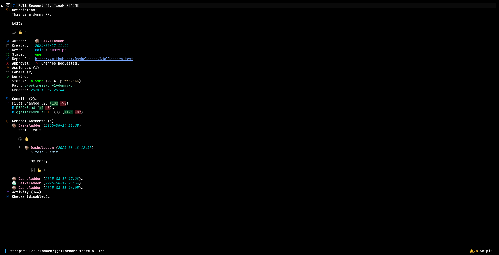
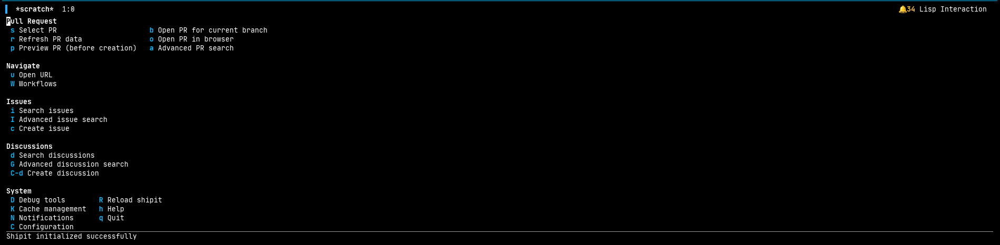
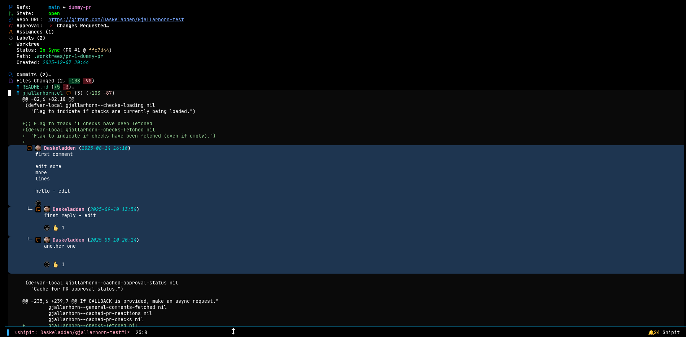
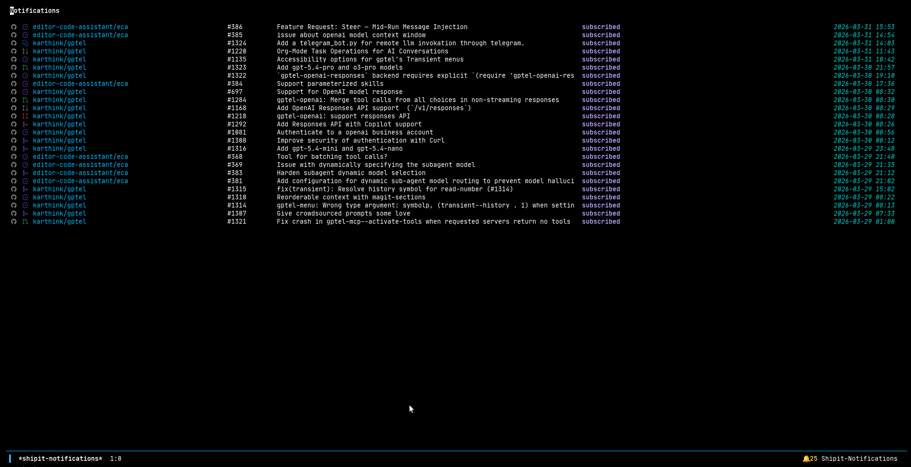
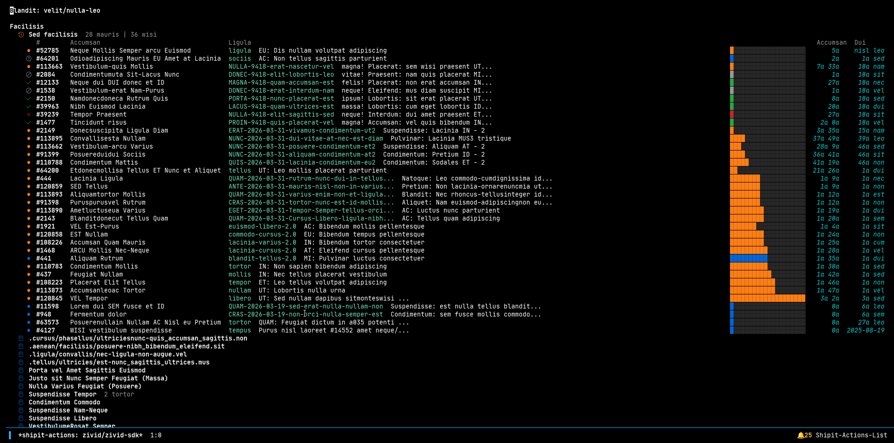

# Shipit

Code review in Emacs. View pull requests, post comments, track CI, and manage notifications without leaving your editor.



This project was built as a learning exercise in agentic AI-assisted programming using [Claude Code](https://claude.ai/claude-code).

**GitHub** is the primary backend with full feature support. **GitLab** and **Jira** backends are available but considered experimental.

## What it does

- **Pull requests** — view description, commits, file changes, labels, assignees, reviewers
- **Linked tracker issues** — PRs show an expandable Issue section auto-detected from the branch name (e.g. `ZIVID-12624-foo` → `ZIVID-12624`); transient actions for search/link, open, browse, transition status, and create-and-link
- **Comments** — inline diff comments with threading, general comments, reactions, live markdown preview
- **Reviews** — submit approvals, request changes, resolve conversations
- **CI/Checks** — expand check suites to see step logs with timestamp gap coloring
- **Notifications** — poll for updates, see activity that triggered each notification, `RET` jumps into the PR at the exact comment/commit/review, mark as read, subscribe to individual threads
- **Issues** — search, create, and view issues with pinned comments, comment pagination, filtering, and status transitions
- **Atlassian dashboard** — dedicated Jira project buffer (`M-x shipit-atlassian-dashboard`) with My Open Issues, Kanban Board, filterable/loadable all-issues section, and a create-issue action
- **Discussions** — view and participate in GitHub Discussions
- **Subscriptions** — manage repo-level and per-thread subscriptions via transient menu
- **Worktrees** — checkout PR branches into isolated worktrees

Supports SVG icons, inline images, avatars, and syntax-highlighted code blocks.

## Install

Emacs 27.1+, [magit](https://magit.vc/), [transient](https://github.com/magit/transient).

Shipit builds on magit-section for all buffer rendering and navigation, and transient for menus and actions.

```elisp
;; straight.el
(use-package shipit
  :straight (:host github :repo "Daskeladden/shipit" :files ("lisp/*.el"))
  :after magit
  :config
  (shipit-init))

;; elpaca
(use-package shipit
  :elpaca (:host github :repo "Daskeladden/shipit" :files ("lisp/*.el"))
  :after magit
  :config
  (shipit-init))

;; manual
(add-to-list 'load-path "/path/to/shipit/lisp")
(require 'shipit)
(shipit-init)
```

## Authentication

Shipit uses Emacs auth-source for credentials. Add entries to `~/.authinfo.gpg` (or `~/.authinfo`):

```
# GitHub
machine api.github.com login your-username password ghp_...

# GitLab
machine gitlab.com login your-username password glpat-...

# Jira
machine your-instance.atlassian.net login your@email.com password your-api-token
```

GitHub tokens need `repo` scope. You can also set `shipit-github-token` directly.

For GitLab and Jira, configure backends in your init file.

**Global Jira backend** (applies to every repo that lacks a more specific
mapping):

```elisp
(setq shipit-issue-backend 'jira)
(setq shipit-issue-backend-config
      '(:base-url "https://your-instance.atlassian.net"
        :project-keys ("PROJ")))
```

Credentials for `your-instance.atlassian.net` are picked up from
auth-source (see the `~/.authinfo.gpg` entry earlier in this section).

**Per-repo mapping** via `shipit-issue-repo-backends` — a list of
`(REPO-PATTERN . CONFIG-PLIST)` where REPO-PATTERN is an exact match or
regexp against `owner/name`:

```elisp
(setq shipit-issue-repo-backends
      '(("myorg/backend"
         :backend jira
         :base-url "https://myorg.atlassian.net"
         :project-keys ("BACK"))
        ("myorg/frontend"
         :backend jira
         :base-url "https://myorg.atlassian.net"
         :project-keys ("FE"))
        ("myorg/.*"
         :backend jira
         :base-url "https://myorg.atlassian.net"
         :project-keys ("MYORG"))))
```

Repos not matching any entry fall back to `shipit-issue-backend`.  The
Atlassian dashboard (`M-x shipit-atlassian-dashboard`) refuses to open
when the resolved backend isn't Jira — if you see that error, add a
matching entry to `shipit-issue-repo-backends`.

Per-repo configuration via `.dir-locals.el` is also supported; set
`shipit-issue-backend` and `shipit-issue-backend-config` as buffer-local
directory variables.

## Usage

Run `M-x shipit` from any git repo with a remote.

Navigate with `TAB` to expand/collapse, `RET` to open, and `M-;` for context actions.

### Issue buffers

| Key | Action |
|-----|--------|
| `f` | Filter comments (author, date, text, reactions, bots) |
| `l` | Jump to Load more and open transient menu |
| `w` | Manage repo/thread subscriptions |
| `n`/`p` | Navigate between sections |

Issues with many comments show the first and last few with a "Load more" section in between. Press `l` to open the load-more transient:

| Key | Action |
|-----|--------|
| `RET` | Load next batch |
| `a` | Load all comments |
| `n` | Load N comments |
| `r` | Toggle direction (recent-first / oldest-first) |

Pinned comments appear prominently between the description and comment sections with a rounded background and truncated preview.

The mode line shows your position when navigating comments: `[42/315 ####------]`

### Atlassian dashboard

`M-x shipit-atlassian-dashboard` opens a Jira-focused buffer with My Open Issues, What's Next, an optional Kanban Board, Frequently Visited, and a full filterable Issues section. `f` opens the filter transient (status, assignee, reporter, type, priority, text/comment search, sort), `l` loads more, `M-;` opens context actions including Create new issue with full Jira fields (issue type, components, labels, assignee).

The dashboard requires the current repo to resolve to a Jira backend. Set up the mapping via `shipit-issue-repo-backends` as shown in the Authentication section, or see the [Backend Configuration wiki page](https://github.com/Daskeladden/shipit/wiki/Backend-Configuration).

## Configuration

```elisp
(setq shipit-use-svglib-icons t)              ; SVG icons (needs svg-lib)
(setq shipit-show-avatars t)                   ; show user avatars
(setq shipit-round-avatars t)                  ; round avatar images
(setq shipit-notifications-enabled t)          ; poll for notifications
(setq shipit-notifications-poll-frequency 300) ; poll interval (seconds)
(setq shipit-render-markdown t)                ; render markdown in descriptions

;; Issue comment pagination
(setq shipit-comments-pagination-threshold 30)  ; paginate above N comments
(setq shipit-comments-initial-count 10)         ; head comments shown
(setq shipit-comments-tail-count 10)            ; tail comments shown
(setq shipit-comments-load-more-default 50)     ; default batch size

;; Pinned comment appearance
(setq shipit-pinned-comment-bg-color "#1a2744") ; rounded bg color (nil to disable)
(setq shipit-pinned-comment-preview-lines 4)    ; lines shown before "View full"
```

## Troubleshooting

`M-x shipit-doctor` checks your token, API access, and rate limits.

`M-x shipit-toggle-debug-logging` enables debug logging to `~/.emacs.d/shipit-debug.log`. Note: debug logging slows down PR loading — disable it when not actively debugging.

## Screenshots

**Main menu (`M-x shipit`)**



**Inline comments with threaded replies**



**Notifications**



**GitHub Actions — workflow runs with elapsed time bars**



## License

GPL-3.0-or-later
